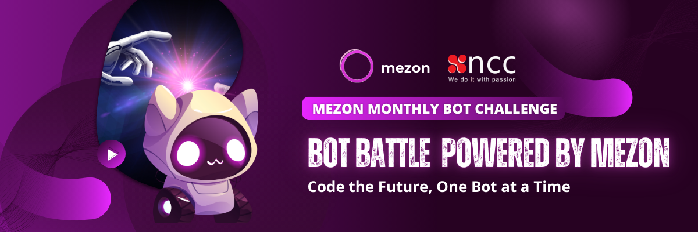

<div align="center">
  <h1>Mezon</h1>
  
  <p align="center">
    <strong>The Live, Work, and Play Platform – the best Discord alternative</strong><br>
    A communication platform for communities, teams, and personal connections.
  </p>

  <p align="center">
    <a href="https://mezon.ai"></a>
    <a href="https://mezon.ai"></a>
    <a href="https://github.com/mezonai/mezon"></a>
  </p>

  <p align="center">
    
    
    
  </p>
</div>

---

<div align="center">
  
</div>

## What is Mezon?

Mezon is a communication platform designed for communities, teams, and personal connections. Whether you're coordinating with your team, building a gaming community, or staying in touch with friends and family, Mezon provides the tools you need.

### Key Use Cases
- 🎮 **Gaming Communities** - Voice chat, tournaments, and streaming integration
- 💼 **Professional Teams** - Team collaboration with channels, file sharing, and integrations  
- 🌍 **Content Creators** - Community building with monetization and engagement tools
- 👥 **Friends & Family** - Private spaces for personal connections

Mezon combines the best aspects of team communication and community platforms in one place.

### Cross-Platform Support
- **Web** - Access via any modern browser with XSS protection
- **Desktop** - Native apps for Windows, macOS, and Linux  
- **Mobile** - iOS and Android applications with full E2E encryption
- **Self-Hosted** - Deploy on your own infrastructure with binary secured sockets

<div align="center">
  <a href="https://www.youtube.com/watch?v=ZTPBE0XyOeY">
    
  </a>
  <p><em>Click to watch the Mezon preview video</em></p>
</div>

---

## 🌟 Core Features

<div align="center">
  <table>
    <tr>
      <td width="50%" valign="top">
        <h3>💬 Communication</h3>
        <ul>
          <li><strong>Text</strong> - Rich formatting, threads, reactions</li>
          <li><strong>Voice</strong> - Crystal-clear, up to 1000 users</li>
          <li><strong>Video</strong> - HD calls, screen sharing, recording</li>
          <li><strong>Files</strong> - Share up to 500MB per file</li>
        </ul>
      </td>
      <td width="50%" valign="top">
        <h3>🛡️ Security & Privacy</h3>
        <ul>
          <li><strong>E2E Encryption</strong> - All messages, voice, video</li>
          <li><strong>Binary Sockets</strong> - Secured connections</li>
          <li><strong>XSS Protection</strong> - Safe message rendering</li>
          <li><strong>Zero Knowledge</strong> - Client-side encryption</li>
        </ul>
      </td>
    </tr>
    <tr>
      <td width="50%" valign="top">
        <h3>🎯 Organization</h3>
        <ul>
          <li><strong>Custom Roles</strong> - Unlimited with granular permissions</li>
          <li><strong>Smart Notifications</strong> - AI-powered filtering</li>
          <li><strong>Channel Categories</strong> - Organized spaces</li>
          <li><strong>Event Scheduling</strong> - Built-in RSVP system</li>
        </ul>
      </td>
      <td width="50%" valign="top">
        <h3>🤖 AI Assistant</h3>
        <ul>
          <li><strong>Content Moderation</strong> - Automated safety</li>
          <li><strong>Real-time Translation</strong> - 100+ languages</li>
          <li><strong>Meeting Summaries</strong> - Auto-generated notes</li>
          <li><strong>Smart Workflows</strong> - Task automation</li>
        </ul>
      </td>
    </tr>
    <tr>
      <td width="50%" valign="top">
        <h3>🔧 Integration</h3>
        <ul>
          <li><strong>100+ Tools</strong> - Connect your favorite apps</li>
          <li><strong>Custom Webhooks</strong> - API integrations</li>
          <li><strong>Bot Support</strong> - Extensible platform</li>
          <li><strong>Analytics</strong> - Community insights</li>
        </ul>
      </td>
      <td width="50%" valign="top">
        <h3>💰 Creator Economy</h3>
        <ul>
          <li><strong>Monetization</strong> - Built-in payment system</li>
          <li><strong>Premium Memberships</strong> - Subscription tiers</li>
          <li><strong>Token Rewards</strong> - Blockchain integration</li>
          <li><strong>Community Growth</strong> - Marketing tools</li>
        </ul>
      </td>
    </tr>
  </table>
</div>

### 🔐 Advanced Security Features

- **Perfect Forward Secrecy** - Rotating encryption keys
- **TLS 1.3** - Latest security protocols  
- **CSRF Protection** - Secure token validation
- **Content Security Policy** - XSS prevention headers
- **Two-Factor Authentication** - TOTP and SMS support
- **GDPR/CCPA Compliant** - Privacy-first data handling

---

## Getting Started

<div align="center">
  <table>
    <tr>
      <td align="center" width="33%">
        <h3>1. Download Mezon</h3>
        <p>Available on all platforms</p>
      </td>
      <td align="center" width="33%">
        <h3>2. Create Your Space</h3>
        <p>Set up in seconds</p>
      </td>
      <td align="center" width="33%">
        <h3>3. Invite Everyone</h3>
        <p>Share and grow together</p>
      </td>
    </tr>
  </table>
</div>

<div align="center">
  <a href="https://github.com/mezonai/mezon" style="text-decoration: none;">
    
  </a>
</div>

---

## Download & Deployment

### 📱 **Client Applications**

<div align="center">
  <table>
    <tr>
      <td align="center">
        <a href="https://mezon.ai">
          <strong>Windows</strong>
        </a>
      </td>
      <td align="center">
        <a href="https://mezon.ai">
          <strong>macOS</strong>
        </a>
      </td>
      <td align="center">
        <a href="https://mezon.ai">
          <strong>Linux</strong>
        </a>
      </td>
      <td align="center">
        <a href="https://mezon.ai">
          <strong>iOS</strong>
        </a>
      </td>
      <td align="center">
        <a href="https://mezon.ai">
          <strong>Android</strong>
        </a>
      </td>
      <td align="center">
        <a href="https://mezon.ai">
          <strong>Web</strong>
        </a>
      </td>
    </tr>
  </table>
</div>


---

## 📚 Resources & Links

<div align="center">
  <table>
    <tr>
      <td width="50%">
        <h3>🚀 Get Started</h3>
        <ul align="left">
          <li><a href="https://mezon.ai/chat"><strong>Try Mezon Chat</strong></a> - Jump right in</li>
          <li><a href="https://mezon.ai/clans/"><strong>Explore Communities</strong></a> - Find your clan</li>
          <li><a href="https://mezon.ai/"><strong>Homepage</strong></a> - Learn more about Mezon</li>
        </ul>
      </td>
      <td width="50%">
        <h3>🛠️ For Developers</h3>
        <ul align="left">
          <li><a href="https://mezon.ai/docs/mezon-sdk-docs/"><strong>SDK Documentation</strong></a> - API reference</li>
          <li><a href="https://mezon.ai/developers/applications"><strong>Developer Portal</strong></a> - Build applications</li>
          <li><a href="https://github.com/mezonai/mezon/issues"><strong>Issues & Support</strong></a> - Report bugs & request features</li>
          <li><a href="https://top.mezon.ai/"><strong>Bot Directory</strong></a> - Discover & create bots</li>
        </ul>
      </td>
    </tr>
    <tr>
      <td width="50%">
        <h3>🌐 Connect With Us</h3>
        <ul align="left">
          <li><a href="https://github.com/mezonai"><strong>GitHub</strong></a> - Contribute to the project</li>
          <li><a href="https://www.facebook.com/mezonworld"><strong>Facebook</strong></a> - Follow for updates</li>
          <li><a href="https://mezon.ai/invite/1840696977034055680"><strong>Community Server</strong></a> - Join our Discord</li>
        </ul>
      </td>
      <td width="50%">
        <h3>📖 Documentation & SDKs</h3>
        <ul align="left">
          <li><a href="DEVELOPER_GUIDE.md"><strong>Developer Guide</strong></a> - Setup & architecture</li>
          <li><a href="https://github.com/mezonai/mezon-go-sdk"><strong>Go SDK</strong></a> - Mezon Go SDK</li>
          <li><a href="https://github.com/mezonai/mezon-js"><strong>JavaScript SDK</strong></a> - Mezon JS SDK</li>
          <li><a href="https://github.com/mezonai/mezon-mcp"><strong>Mezon MCP</strong></a> - AI ready integration</li>
        </ul>
      </td>
    </tr>
  </table>
</div>

---

## 🌟 What You Get with Mezon

<div align="center">
  
</div>

| Feature | What You Get | Why It Matters |
|---------|--------------|----------------|
| **💰 Pricing** | Free forever core features | Focus budget on growth, not software |
| **🔒 Security** | End-to-end encryption + Self-hosting | Complete data ownership and privacy |
| **🤖 AI Assistant** | Built-in automation & moderation | Work smarter, keep communities safe |
| **🌍 Platform** | Web, Desktop, Mobile + 100+ integrations | Use anywhere, connect everything |
| **📞 Communication** | HD voice/video + Screen sharing | Professional meetings made simple |
| **👥 Scale** | Unlimited members + 500MB files | Grow without limits or restrictions |

---

## 👨‍💻 For Developers

Interested in building on Mezon or contributing to the platform? Check out our comprehensive [Developer Guide](DEVELOPER_GUIDE.md) for detailed instructions.

### 🛠️ **Quick Start**

```bash
# Clone the repository
git clone https://github.com/mezonai/mezon.git
cd mezon

# Install dependencies
yarn install

# Start development server
yarn dev:chat
```

The application will be available at http://localhost:4200/

📚 **For detailed setup, architecture, and contribution guidelines, see the [Developer Guide](DEVELOPER_GUIDE.md)**

### 📁 **Project Structure**

```
mezon/
├── apps/
│   ├── chat/          # Main chat application
│   └── admin/         # Admin dashboard
├── libs/
│   ├── ui/            # UI components
│   ├── components/    # Business logic components
│   ├── store/         # State management
│   ├── transports/    # API & WebSocket
│   └── core/          # Shared utilities
└── docs/              # Documentation
```

### 🔧 **Technology Stack**

**Frontend (Cross-Platform)**
- **Web**: React 18 + TypeScript
- **Desktop**: Electron (Windows, macOS, Linux)
- **Mobile**: React Native (iOS, Android)

**Backend & Infrastructure**
- **Core Engine**: Built on [Nakama](https://heroiclabs.com/nakama/) - High-performance game server in Go
- **Performance**: Sub-millisecond response times, handles millions of concurrent connections
- **Database**: PostgreSQL + Redis with automatic sharding and replication
- **Real-time**: Nakama Socket with binary protocol for ultra-low latency
- **Security**: End-to-end encryption, TLS 1.3, built-in DDoS protection
- **Scalability**: Horizontal scaling, auto-clustering, load balancing

**Development**
- **Build System**: Nx monorepo
- **State Management**: Redux Toolkit
- **Styling**: Tailwind CSS
- **Testing**: Jest + Cypress

### 📚 **Getting Started**

1. **Read the [Developer Guide](DEVELOPER_GUIDE.md)** for detailed setup instructions
2. **Check out [Architecture docs](docs/developer/ARCHITECTURE.md)** to understand the system
3. **Browse [open issues](https://github.com/mezonai/mezon/issues)** for contribution opportunities
4. **Join our [developer community](https://mezon.ai/invite/1840696977034055680)** for support

### 🏠 **Self-Hosting**

Mezon can be deployed on your own infrastructure for complete control and privacy:

```bash
# Using Docker Compose
git clone https://github.com/mezonai/mezon.git
cd mezon
docker-compose up -d

# Or using Kubernetes
kubectl apply -f k8s/
```

**Requirements:**
- Docker & Docker Compose (recommended)
- Node.js 18+ (for manual deployment)
- PostgreSQL 14+
- Redis 6+

See [Self-Hosting Guide](docs/SELF_HOSTING.md) for detailed instructions.

### 🤝 **Contributing**

We welcome contributions! Please see our [Contributing Guidelines](CONTRIBUTING.md) for:
- Code style and standards
- Pull request process
- Issue reporting
- Development workflow

---

## 🎯 Perfect For Everyone

### 👥 For Friends & Families
- Private spaces to stay connected
- Share photos, videos, and memories
- Voice and video calls that just work

### 🎮 For Gamers
- Low-latency voice chat
- Game integration and activity status
- Tournament and event organization tools

### 💼 For Teams & Businesses
- Professional workspaces
- Task management and productivity tools
- Secure and compliant communication

### 🌍 For Communities
- Powerful moderation tools
- Event scheduling and announcements
- Growth and engagement analytics

---

## ❓ Frequently Asked Questions

<details>
<summary><strong>Is Mezon really free?</strong></summary>
<p>Yes! Mezon is free to use with no hidden costs. We offer optional premium features for power users, but everything you need to communicate and build communities is completely free.</p>
</details>

<details>
<summary><strong>Can I migrate from Discord or Slack?</strong></summary>
<p>Absolutely! We provide easy migration tools to help you move your community or workspace to Mezon seamlessly.</p>
</details>

<details>
<summary><strong>Is Mezon secure?</strong></summary>
<p>Your privacy and security are our top priorities. All communications are encrypted, and we never sell your data.</p>
</details>

<details>
<summary><strong>What makes the AI assistant special?</strong></summary>
<p>Our AI assistant is built right into Mezon, helping with everything from moderating communities to scheduling meetings and answering questions.</p>
</details>

---

## 🚀 Join the Mezon Community

<div align="center">
  <h3>Ready to get started?</h3>
  
  <a href="https://mezon.ai">
    
  </a>
  
  <p>
    <a href="https://mezon.ai/invite/1840696977034055680">Join our Community</a> •
    <a href="https://github.com/mezonai/mezon">Star on GitHub</a> •
    <a href="https://mezon.ai/clans/">Explore Communities</a>
  </p>
</div>

---

## 👨‍💻 Additional Resources

Building something amazing? Check out our resources:

### 📚 **Documentation & Guides**
- 📖 [Developer Guide](DEVELOPER_GUIDE.md) - Complete development documentation
- 🛠️ [API Documentation](docs/developer/API.md) - REST API reference
- 🎨 [Contributing](CONTRIBUTING.md) - How to contribute
- 🐛 [Issues & Support](https://github.com/mezonai/mezon/issues) - Report bugs & request features

### 🤖 **Bot Development**
- 🎯 [Bot Example](https://github.com/mezonai/mezon-bot-example) - Simple bot template
- 🏢 [Komu Bot](https://github.com/mezonai/mezon-komu) - Full-featured workplace bot
  - ✅ Check-in/check-out tracking
  - 📊 Timesheet logging  
  - 📚 Audiobook integration
  - 🏖️ Absence day requests
  - 📈 Daily reports & meetings

### 📦 **SDKs & Libraries**
- 🐹 [Go SDK](https://github.com/mezonai/mezon-go-sdk) - Official Go SDK
- 🟨 [JavaScript SDK](https://github.com/mezonai/mezon-js) - Official JS SDK  
- 🤖 [Mezon MCP](https://github.com/mezonai/mezon-mcp) - AI-ready integration

---

<div align="center">
  <p>
    <strong>Mezon</strong> - Where communities come alive<br>
    Made with ❤️ by the Mezon Team
  </p>
  
  <p>
    <a href="https://mezon.ai/terms">Terms</a> •
    <a href="https://mezon.ai/privacy">Privacy</a> •
    <a href="https://mezon.ai/guidelines">Guidelines</a>
  </p>
</div>

## Mezon mainnet


